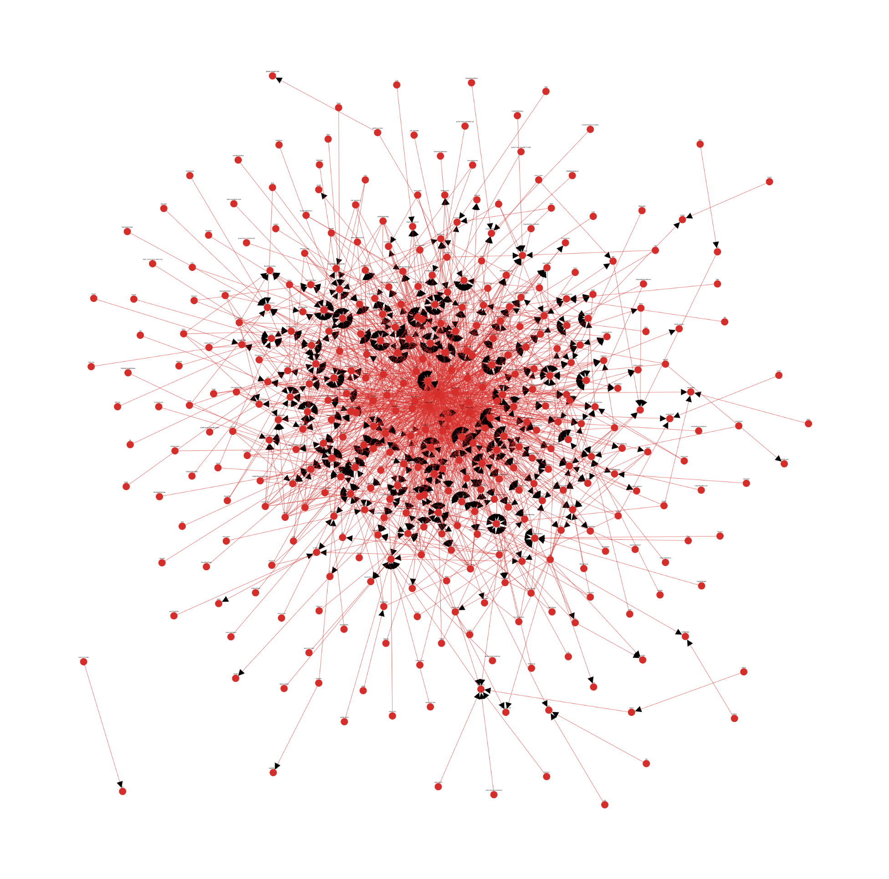

idea: what if we could write a cypress plugin that only runs tests against components that depend on the diff of PR to master?
if we're upgrading a library, we should only have to test components that integrate with said library

1. graph of package / component dependencies
2. ignore "global" dependencies like react, propr-types, typescript etc.
3. get components relevant to a PR, walk back to find dependencies X layers deep, then run tests relevant to those components

questions: 
1. how many layers of recursion to determine x is dependent on y since y is dependent on z since ...
2. need a component-based test suite as opposed to "webpage-based" or whatever
